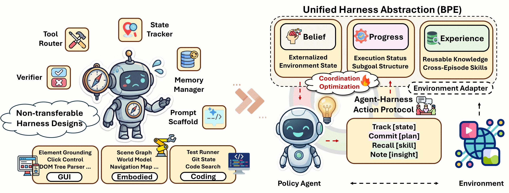
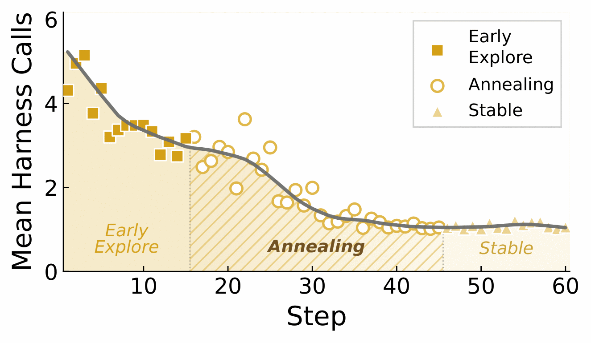
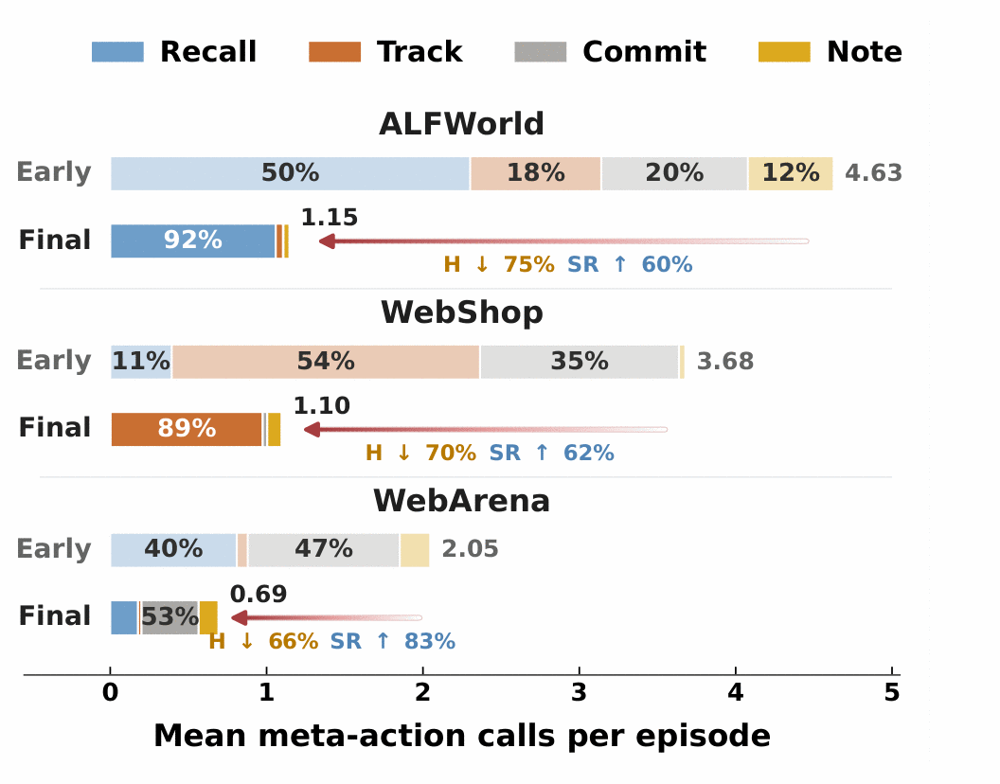
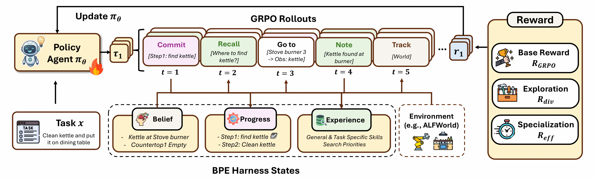

<div align="center">

<h1>EvoHarness-RL</h1>

<p><b>Learning Runtime Harness Coordination for Self-Evolving Agents</b></p>

<p>
<a href="https://arxiv.org/abs/2608.05446"></a>
<a href="#"></a>
<a href="https://venturebeat.com/orchestration/meta-researchers-taught-an-8b-ai-model-to-match-claude-opus-4-5-without-the-frontier-price-tag"></a>
<a href="LICENSE"></a>
<a href="pyproject.toml"></a>
</p>



</div>

Long-horizon LLM agents lean on external support — state trackers, planners, memory
banks — but each harness is built for one environment and driven by hand-written
prompts and heuristics, so the agent and its harness can never be optimized together.

**EvoHarness-RL** puts every one of those behind one policy-facing interface: a
**B**elief / **P**rogress / **E**xperience workspace reachable through four actions,
`track`, `commit`, `recall`, `note`. The agent spends the *same* interaction budget on
them as on environment actions, so cost-aware GRPO can teach it **when external support
is worth paying for** — and when the policy should just handle it internally.

One code path covers **ALFWorld**, **WebShop** and **WebArena**: inference, ablations
and RL training all run through the same harness, on the same prompt format.

---

## Results

Across three heterogeneous long-horizon benchmarks, the frozen BPE scaffold lifts
frontier models by **+19.2% relative**, and learned coordination beats the strongest
trainable baseline by **+11.7% relative**. All numbers are success rates (%).

**Open-source backbone (Qwen3-8B).** `*` frozen · `▲` trainable

| Method | | ALFWorld | WebShop SR | WebShop Score | WebArena |
| :-- | :-: | :-: | :-: | :-: | :-: |
| ReAct | `*` | 47.8 | 12.0 | 42.9 | 14.0 |
| ExpeL | `*` | 50.7 | 7.0 | 25.7 | 18.0 |
| ReasoningBank | `*` | 56.2 | 11.4 | 35.4 | 14.0 |
| Dynamic Cheatsheet | `*` | 52.1 | 5.2 | 20.4 | 18.0 |
| ACE | `*` | 51.4 | 3.2 | 13.2 | 16.0 |
| SkillOS-base | `*` | 53.1 | 13.6 | 38.6 | 16.0 |
| GRPO | `▲` | 66.4 | 73.0 | 82.4 | 18.0 |
| SkillOS | `▲` | 61.2 | 16.5 | 40.6 | 18.0 |
| SkillRL | `▲` | 85.0 | 73.2 | 85.5 | 18.0 |
| **EvoHarness-Base** | `*` | 56.4 | 18.6 | 43.7 | 18.0 |
| **EvoHarness-SFT** | `▲` | 68.6 | 43.8 | 48.1 | 16.0 |
| **EvoHarness-RL** | `▲` | **95.0** | **80.6** | **90.8** | **26.0** |

**Frontier models, no parameter updates.** The same scaffold, dropped in at inference time.

| Backbone | ALFWorld | WebShop SR | WebArena |
| :-- | :-: | :-: | :-: |
| ReAct (Claude Opus 4.6) | 96.4 | 40.2 | 22.0 |
| **+ EvoHarness-Base** | **98.6** | **46.4** | **34.0** |
| ReAct (GLM-5) | 52.1 | 46.2 | 20.0 |
| **+ EvoHarness-Base** | **77.9** | **49.6** | **22.0** |
| ReAct (GPT-5) | 60.7 | 37.8 | 20.0 |
| **+ EvoHarness-Base** | **85.0** | **46.2** | **26.0** |

### What training actually learns

<p align="center">


</p>

**Harness annealing.** Harness use falls while task success keeps climbing, through
three phases — broad exploration, annealing, then a stable floor around one call per
episode. Early on the policy leans on external support to stabilize long-horizon
execution; as recurring patterns get internalized, routine decisions move inside the
model and the harness is kept for what stays genuinely worth externalizing. SFT inherits
the teacher's habit of narrating everything (9.03 calls/episode for 59.3% success); RL
settles at **2.98 calls at 95.0% success**.

**Coordination specialization.** The same recipe converges to *different* habits per
environment. Mean calls/episode, early → final: ALFWorld 4.63 → 1.15 (keeps `recall` —
object locations and routines repeat), WebShop 3.68 → 1.10 (keeps `track` — every
episode is a fresh constraint set), WebArena 2.05 → 0.69 (stays mixed, `commit` carries
the longer workflows).

**Harness evolution.** Consolidation starts `ADD`-heavy and shifts to `UPDATE` as the
bank fills — maintenance, not append-only accumulation. A co-evolving bank beats a
frozen one (95.0 vs 93.6 on ALFWorld), and self-consolidation with Qwen3-8B works
without a frontier consolidator.

---

## The BPE workspace

The workspace `H_t = (B_t, P_t, E_t)` has three parts, each reached by one verb:

| Part | Holds | Lifetime | Meta-action |
| --- | --- | --- | --- |
| **B**elief | externalized environment state (scene graph, cart, visited pages) | one episode | `track [query]` |
| **P**rogress | committed subgoals and their status | one episode | `commit [subgoal]` |
| **E**xperience | skills, mistakes and search hints from past episodes | persists, evolves | `recall [query]`, `note [insight]` |

The policy acts over `A = A_env ∪ {commit, track, recall, note}`. Meta-actions never
touch the simulator, but by default they spend the same step budget as environment
actions — which is exactly what makes "is this call worth it?" a learnable question.

An illustrative ALFWorld episode (`put a clean kettle on the diningtable`):

```text
t=1  <action>recall [where are kettles usually found]</action>
     → RECALLED: [clean] kettles sit on stoveburners or countertops; check burners first
t=2  <action>commit [1. find kettle | 2. clean it | 3. put on diningtable]</action>
     → PLAN: [ ] find kettle  [ ] clean it  [ ] put on diningtable
t=3  <action>go to stoveburner 3</action>
     → On the stoveburner 3, you see a kettle 2.
t=4  <action>note [kettle was on a burner, not the countertop]</action>
     → NOTE: saved as evidence for the next consolidation
t=5  <action>track [kettle]</action>
     → kettle 2 @ stoveburner 3 · countertop 1 empty
```

### Coordination modes

| `harness.mode` | What the policy sees |
| --- | --- |
| `env_only` | environment actions only, no harness (ReAct baseline) |
| `always_on` | Belief / Progress / Experience panels injected every turn; env-only action space |
| `inline` | the four meta-actions; results shown on the next turn |

`harness.belief`, `harness.plan` and `harness.experience` switch single modules off for
ablations: a disabled module disappears from the system prompt and its verb fails if the
policy uses it anyway.

---

## Quickstart

```bash
pip install -e ".[dev]"            # core harness + tests
pytest                             # toy-env tests, no simulators needed

pip install -e ".[alfworld]"       # + ALFWorld
```

Serve a policy with any OpenAI-compatible server, then run one config:

```bash
MODEL=/path/to/checkpoint NAME=policy bash scripts/serve_vllm.sh

python -m evoharness eval --config configs/eval/alfworld.yaml \
    policy.model=policy bank.path=/path/to/skill_bank.json
python -m evoharness eval --config configs/eval/webshop.yaml \
    policy.model=policy env_options.data_dir=/path/to/webshop/data
python -m evoharness eval --config configs/eval/webarena.yaml \
    policy.model=policy env_options.servers='[http://host:36005]'
```

<details>
<summary><b>Setting up the three environments</b></summary>

<br>

**ALFWorld.** `pip install alfworld`, then `alfworld-download` and
`export ALFWORLD_DATA=~/.cache/alfworld`. Splits: `train`, `valid_seen` (140),
`valid_unseen` (134).

**WebShop.** Install [WebShop](https://github.com/princeton-nlp/WebShop) so that
`web_agent_site` is importable, download its product data and search index, and pass the
data folder as `env_options.data_dir`. Its search engine (pyserini) needs a JVM
(`JAVA_HOME`, `JVM_PATH`). Splits: `test` (goals 0–499), `train` (the rest).
`env_options.small=true` uses the 1k-product set.

**WebArena.** Host the WebArena sites
([instructions](https://github.com/web-arena-x/webarena/blob/main/environment_docker/README.md)),
then start the bundled `agentenv-webarena` server, which owns the browser and the
official evaluator:

```bash
cd training/agentgym-rl/AgentGym/agentenv-webarena
export SHOPPING=http://<host>:7770 SHOPPING_ADMIN=http://<host>:7780/admin REDDIT=http://<host>:9999 \
       GITLAB=http://<host>:8023 MAP=http://<host>:3000 WIKIPEDIA=... HOMEPAGE=http://<host>:4399
source setup.sh                    # installs WebArena + playwright, logs in to the sites
python -c "import uvicorn; from agentenv_webarena import app; uvicorn.run(app, host='0.0.0.0', port=36005)"
```

Site URLs default to `127.0.0.1` with the standard ports. The fuzzy-match evaluators call
an LLM judge: set `OPENAI_API_KEY` / `OPENAI_BASE_URL` (and optionally `WA_JUDGE_MODEL`).
List one or more servers in `env_options.servers`; workers are spread across them. The
split is a task-list JSON: `data/webarena_eval_50.json` or `data/webarena_train.json`
(disjoint).

</details>

---

## Evaluation

Any field can be overridden with `key=value`. Common ones:

```bash
harness.mode=always_on                  # panels-only variant
harness.mode=env_only                   # ReAct baseline
harness.belief=false                    # single-module ablation
harness.charge_meta_actions=false harness.max_meta_actions=6   # free meta-actions, capped
bank.mode=evolve bank.evolver.model=<consolidator>             # learn online during eval
split=valid_unseen limit=20 workers=8
```

Outputs land in `out_dir`: `trajectories/<task>.json` (turn-by-turn trace, final belief
and plan, meta-action counts), `summary.json` (success rate, mean score, steps/turns,
meta-actions per episode, per-task-type breakdown) and `config.json` (resolved config,
API keys removed, plus a fingerprint).

Rerunning a frozen-bank evaluation into the same `out_dir` skips tasks whose record
carries the same fingerprint, so interrupted runs resume. The fingerprint covers
everything that changes the policy's inputs, including the bank file's hash. Tasks that
keep failing (e.g. a WebArena site is down) are retried, reported under `errors`, and
never cached.

<details>
<summary><b>The skill bank, and how it evolves</b></summary>

<br>

```json
{
  "general_skills":       [{"skill_id", "title", "principle", "when_to_apply", "usage_count"}],
  "task_specific_skills": {"<task type>": [ ... ]},
  "common_mistakes":      [{"mistake_id", "description", "why_it_happens", "how_to_avoid", "usage_count"}],
  "search_priorities":    {"egg": ["fridge", "countertop"]},
  "notes":                ["[<task type>] <insight>"],
  "meta":                 {"updates": 0}
}
```

`bank.mode=frozen` (default) reads it and never writes. `bank.mode=evolve` copies it to
`out_dir/bank.json` and runs tasks in windows of `bank.consolidate_every`: the bank is
frozen while a window runs in parallel, then the evolver LLM sees the window's successful
and failed action sequences plus `note` insights and returns `add / update / merge /
delete` edits.

Evidence is sorted before consolidation, so the result does not depend on worker order;
an evolving run always restarts from the seed bank instead of resuming. Edits are
validated: ids must exist, categories hold at most `max_per_category` entries, and
entries retrieved at least `delete_veto_usage` times cannot be deleted.

</details>

---

## Supervised initialization

GRPO starts from a checkpoint that already speaks the harness. `scripts/sft.sh` builds
one: a teacher drives the same `Episode` the student will be evaluated with, and its
successful episodes become the targets. Collection *is* an evaluation run, so everything
in [Evaluation](#evaluation) carries over — the environment pool, per-task resume,
retries, and a `summary.json` whose success rate is the honest gate on data quality.

```bash
# Any OpenAI-compatible endpoint; the key never enters the repo or the run's config.json.
export OPENAI_BASE_URL=... OPENAI_API_KEY=...
ENV=alfworld bash scripts/sft.sh policy.model=<teacher>

# Stages run independently; collection resumes where it left off.
STAGES="collect" ENV=alfworld bash scripts/sft.sh
STAGES="train merge" ENV=alfworld bash scripts/sft.sh trainer.total_epochs=2
```

Training and merging run in the path-A environment (`requirements-train.txt`); the
`collect` and `convert` stages need only the core package plus the environment.

Four stages: `collect` (teacher trajectories under `out_dir/trajectories/`), `convert`
(`sft_train.parquet` / `sft_val.parquet`), `train` (LoRA via the vendored
`verl.trainer.fsdp_sft_trainer`), `merge` (a full checkpoint for `MODEL=`). Add
`sanity` to evaluate the result on 20 tasks.

**Context and layout.** A supervised example has to replay the call the policy will
actually receive, and the two training paths shape that call differently:

| | `context` | one row is | initializes |
| --- | --- | --- | --- |
| ALFWorld, WebShop | `per_turn` | system prompt + few-shots + the turn | path A |
| WebArena | `accumulated` | the whole conversation prefix | path B |

`context` defaults to the environment's own (`Domain.context`) because it has to match
the stack that trains on it. For `per_turn`, `sft.layout=fused` puts everything in one
user message (byte-identical to evaluation and to path A) and `system` reproduces the
published recipe. ALFWorld's seven demonstrations live in
`evoharness/envs/alfworld/demonstrations.py`; disable them with `sft.few_shots=false`.

**Hyperparameters** (`scripts/sft.sh`, the rest left at the trainer's defaults):

| | ALFWorld, WebShop | WebArena |
| --- | --- | --- |
| LoRA | r=64, α=128, `all-linear` | same |
| Optimizer | AdamW, lr 1e-5, cosine, 10% warmup | same |
| Batch / micro-per-GPU | 16 / 2 | 8 / 1 |
| Max length / truncation | 4096 / right | 16384 / left |
| Epochs / GPUs | 4 / 8 | 3 / 2 |

---

## GRPO training

Two training stacks are bundled under `training/`, matching the two setups the reported
runs used. Both install a package named `verl`, so give each its own environment.

> Both paths start from an SFT checkpoint passed as `MODEL=`.
> [Supervised initialization](#supervised-initialization) builds one.

<p align="center">

</p>

A rollout interleaves environment actions with BPE meta-actions, each one reading or
writing Belief, Progress or Experience. GRPO then updates the policy with a composite
reward: the base objective, an annealed exploration bonus over the four meta-actions,
and an efficiency term — the push from broad harness exploration toward selective,
task-adaptive coordination.

| | Path A: verl-agent | Path B: AgentGym-RL |
| --- | --- | --- |
| Code | `training/verl-agent` + `evoharness/rl` | `training/agentgym-rl` |
| Used for | ALFWorld, WebShop | WebArena (the reported run) |
| Harness | `evoharness` `Episode`s inside the env manager | meta-actions intercepted in the vLLM rollout |
| Context | one prompt per turn (same as evaluation) | accumulated multi-turn conversation |
| Requirements | `requirements-train.txt` (torch 2.8, vLLM 0.11, Py 3.11) | `requirements-agentgym.txt` (torch 2.6, vLLM 0.8.5, Py 3.10) |

### Path A — verl-agent

```bash
pip install -r requirements-train.txt
pip install -e training/verl-agent --no-deps
pip install -e ".[alfworld]"

ENV=alfworld MODEL=/path/to/sft_checkpoint BANK=/path/to/skill_bank.json \
EVOLVER_MODEL=<consolidator> EVOLVER_URL=http://host:8001/v1 \
    bash scripts/train.sh trainer.experiment_name=alfworld_grpo
```

`scripts/train.sh` writes the placeholder parquet and calls
`python -m evoharness.rl.train --config-name $ENV`. `configs/train/common.yaml` holds
shared settings; each benchmark file sets batch sizes, horizon and lengths. Harness
settings live under `env.harness`, reward settings under `reward_shaping`, the rest is
standard verl-agent config.

`reset` picks `train_batch_size` tasks and repeats each `env.rollout.n` times (contiguous
rows form one GRPO group). Every row is an `Episode` whose meta-actions are answered by
the workspace without stepping the environment. On its final turn the row receives

```
R = success_reward·won + λ_eff·R_eff + λ_div(u)·R_div − λ_spam·min(S, C) − λ_inv·I
```

(`evoharness/rl/reward.py`), where `R_eff = (T_max − |τ|)/T_max` on success, `R_div` is
the unique-verb ratio or meta-action coverage, `S` counts consecutive repeated actions,
`I` invalid ones, and `λ_div` anneals with a cosine over `trainer.total_epochs` updates —
the exploration-into-specialization schedule behind the annealing plot above. The bank is
read-only during a batch and consolidated once at the next `reset`; the update counter
`u` lives in the bank, so it survives restarts.

### Path B — AgentGym-RL (WebArena)

```bash
pip install -r requirements-agentgym.txt
pip install -e training/agentgym-rl/AgentGym-RL --no-deps
pip install -e training/agentgym-rl/AgentGym/agentenv --no-deps

# agentenv-webarena server running (see Environments), plus an OpenAI-compatible
# endpoint for the model that reflects on episodes at epoch boundaries:
export OPENAI_BASE_URL=... OPENAI_API_KEY=...
MODEL=/path/to/sft_checkpoint BANK_PATH=/path/to/seed_bank.json REFLECTOR_MODEL=<model> \
ENV_SERVER_URL=http://127.0.0.1:36005 \
    bash scripts/train_webarena_agentgym.sh
```

The launcher's defaults are those of the reported run: 32 tasks × 4 rollouts, lr 1e-6,
KL 0.01, 2 PPO epochs, interaction rounds growing 10 → 14 → 17 every 80 updates, shaped
reward (`λ_eff = λ_div = 0.02`, `λ_spam = λ_inv = 0.01`), and reflect-then-reconcile
consolidation at each epoch boundary. Without `BANK_PATH` the bank starts empty;
`HARNESS=0` gives the sparse GRPO baseline.

---

## Repository layout

```
evoharness/
├── actions.py      A_bpe and response parsing      ├── rollout.py   drive one episode
├── plan.py         P_t: committed subgoals         ├── runner.py    parallel eval, resumable
├── belief.py       B_t interface (per environment) ├── config.py    YAML + dotted overrides
├── experience.py   E_t: the skill bank             ├── llm.py       OpenAI-compatible client
├── evolver.py      LLM consolidator: evidence -> bank edits
├── workspace.py    H_t: meta-action dispatch and injected panels
├── episode.py      one episode: budget, history, prompt, trace
├── prompts.py      system-prompt assembly per mode/ablation
├── domain.py       environment plugin contract (Domain, Env, Step, Task)
├── envs/           alfworld/ webshop/ webarena/
├── rl/             reward.py, env_manager.py, train.py, prepare_data.py
└── sft/            collect.py, dataset.py, merge.py (teacher -> parquet -> LoRA)
configs/            eval/ sft/ and train/ (train layers on verl-agent's ppo_trainer.yaml)
data/               WebArena splits (frozen 50-task eval, 372-task train)
scripts/            vLLM serving, SFT and GRPO launchers
tests/              harness tests on a toy environment (no simulators needed)
training/           verl-agent (path A) and agentgym-rl (path B)
```

Everything above the `Domain` line is shared. An environment contributes only its prompt
text, a `Belief`, its task taxonomy, and an `Env` adapter. Supervised initialization,
inference and GRPO all build the policy's input through `Episode.messages()` and account
steps through `Episode.act`/`observe`, so a policy is trained and evaluated on exactly
the same input format.

---

## Adding an environment

Implement a `Domain` (see `evoharness/envs/webshop/` for a compact example):

```python
class MyDomain(Domain):
    name = "mine"
    prompt = PromptSpec(...)            # intro, env actions, per-module tool docs, footers
    experience = MyExperience()         # ExperienceDomain: task types, search-priority rule
    action_format = TAG_FORMAT          # or FENCE_FORMAT

    def make_belief(self): ...          # a Belief: reset / update / track / render
    def make_env(self, worker=0, **options): ...   # reset(task) -> Step, step(action) -> Step
    def list_tasks(self, split, **options): ...    # [Task(id, data)]
```

Register it in `evoharness/envs/__init__.py`; evaluation, ablations, the evolving bank
and GRPO training then work without further changes.

---

## Citation

```bibtex
@misc{ning2026evoharnessrllearningruntimeharness,
      title={EvoHarness-RL: Learning Runtime Harness Coordination for Self-Evolving Agents},
      author={Xuying Ning and Dongqi Fu and Tianxin Wei and Yuanchen Bei and Xiyuan Yang and Wujiang Xu and Yueqi Song and Bingxuan Li and Zihao Li and Hanqing Zeng and Xiang Shen and Yajuan Wang and Yifan Wu and Qifan Wang and Jiayi Liu and Hong Li and Yinglong Xia and Xiangjun Fan and Hanghang Tong and Jingrui He},
      year={2026},
      eprint={2608.05446},
      archivePrefix={arXiv},
      primaryClass={cs.LG},
      url={https://arxiv.org/abs/2608.05446},
}
```

## License

MIT — see [`LICENSE`](LICENSE). Third-party attributions are in [`NOTICE`](NOTICE); the
training stacks vendored under `training/` keep their own upstream licenses (verl,
verl-agent, AgentGym-RL, AgentGym).
